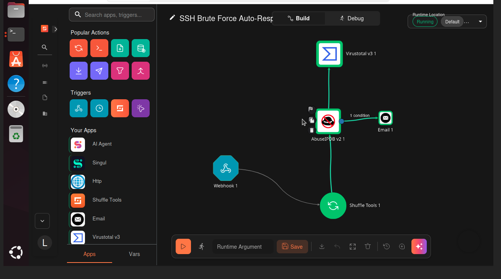
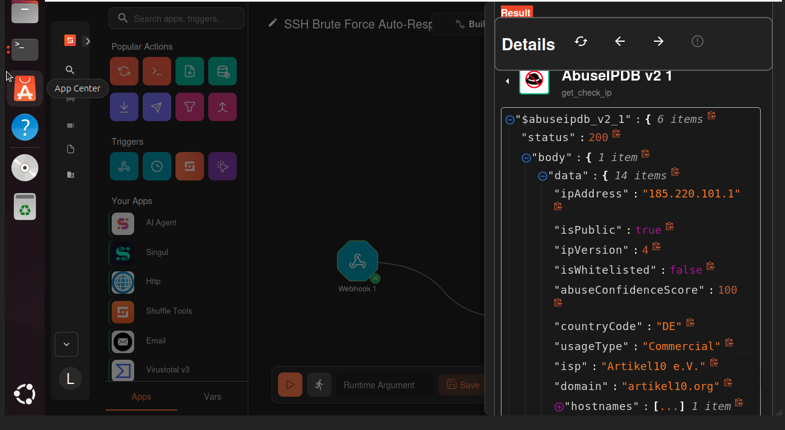
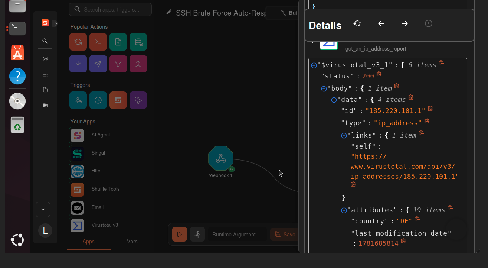
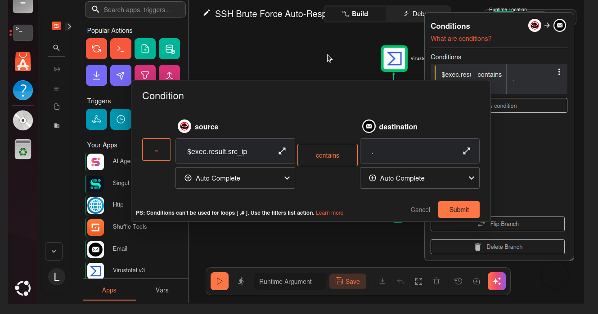
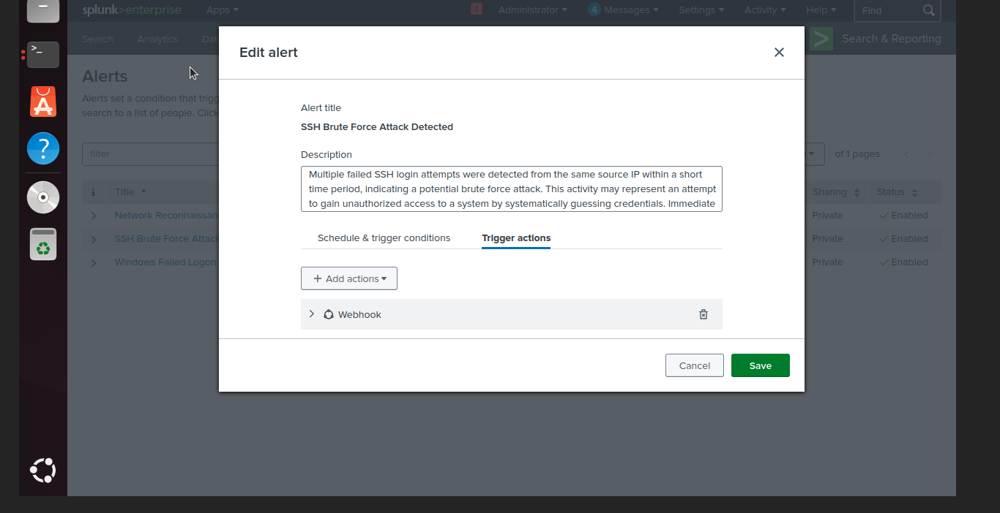
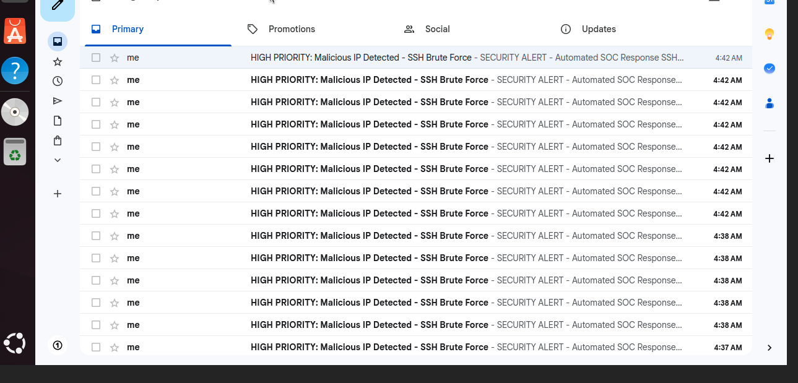
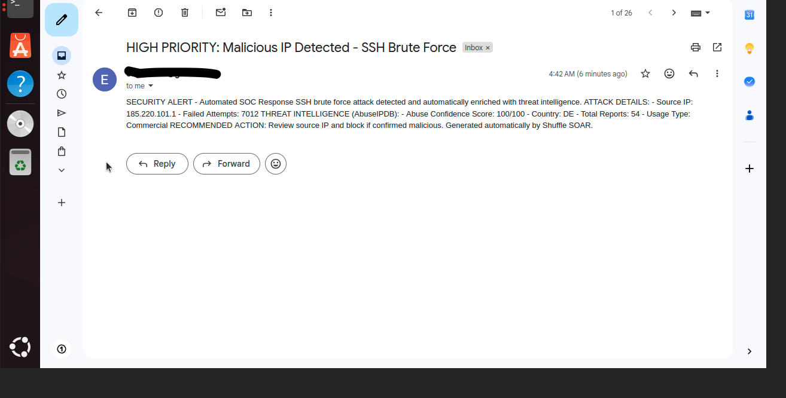
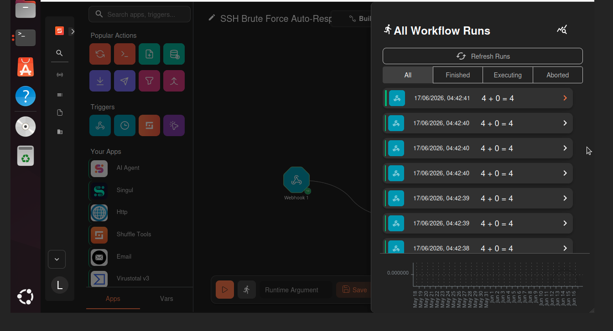

# 🤖 Security Automation with Shuffle SOAR


## Objective
Build an automated Security Orchestration, Automation, and Response (SOAR) pipeline that detects SSH brute force attacks via Splunk SIEM and automatically triggers an investigation workflow in Shuffle. The workflow extracts the attacker IP, enriches it against two independent threat intelligence sources (AbuseIPDB and VirusTotal), applies conditional logic, and dispatches an enriched email alert to the SOC — replicating the automated tier-1 triage performed in enterprise security operations centers.

---

## Why This Project Matters

In a real SOC, analysts are overwhelmed with alerts. SOAR platforms automate the repetitive investigation steps — pulling threat intelligence, correlating data, and notifying the right people — so analysts can focus on decisions instead of manual lookups. This project demonstrates that exact capability end to end.

---

## Automated Response Pipeline

```
Hydra SSH Brute Force Attack (Kali)
            ↓
Splunk SIEM detects failed logins → Alert fires
            ↓
Splunk Webhook Action → POST to Shuffle
            ↓
┌─────────────────────────────────────────────┐
│  SHUFFLE SOAR WORKFLOW                        │
│                                               │
│  1. Webhook receives alert payload            │
│  2. Extract attacker source IP                │
│  3. AbuseIPDB reputation lookup               │
│  4. VirusTotal reputation lookup              │
│  5. Conditional logic evaluates attack        │
│  6. Enriched email alert dispatched to SOC    │
└─────────────────────────────────────────────┘
            ↓
SOC Analyst receives enriched alert with
threat intelligence context attached
```

---

## Environment

| Component | Details |
|-----------|---------|
| SOAR Platform | Shuffle (self-hosted via Docker) |
| SIEM | Splunk Enterprise on Ubuntu 24.04 |
| Hypervisor | Proxmox VE on HP EliteDesk |
| Attack Machine | Kali Linux VM |
| Victim Endpoint | Raspberry Pi 5 (SSH target) |
| Threat Intel | AbuseIPDB API + VirusTotal API |
| Containerization | Docker + Docker Compose v2 |
| Notification | Gmail SMTP |

---

## Tools & Technologies

| Tool | Purpose |
|------|---------|
| Shuffle SOAR | Workflow automation and orchestration |
| Splunk Enterprise | SIEM detection and webhook triggering |
| Docker | Container platform hosting Shuffle |
| AbuseIPDB | IP reputation threat intelligence |
| VirusTotal | Secondary IP reputation cross-reference |
| Hydra | SSH brute force attack simulation |
| Gmail SMTP | Automated alert delivery |

---

## Implementation

### 1. Shuffle Deployment via Docker

Deployed Shuffle as a containerized application on a dedicated Ubuntu VM, separating the SOAR platform from the SIEM — mirroring enterprise architecture where orchestration runs independently from detection.

```bash
git clone https://github.com/Shuffle/Shuffle
cd Shuffle
sudo sysctl -w vm.max_map_count=262144
sudo docker compose up -d
```

### 2. Webhook Trigger Configuration

Created a webhook trigger in Shuffle to receive alert payloads, then configured a Splunk webhook alert action to POST detection data automatically when the SSH brute force alert fires.

### 3. Splunk Detection Search

```spl
index=main host="raspberrypi" "Failed password"
| rex field=_raw "from (?<src_ip>\d+\.\d+\.\d+\.\d+)"
```

The `rex` command extracts the attacker's source IP from the raw log into a clean named field, which Splunk passes to Shuffle in the webhook payload.

### 4. Threat Intelligence Enrichment

The workflow enriches the extracted IP against two independent sources:
- **AbuseIPDB** — returns abuse confidence score, total reports, country, and usage type
- **VirusTotal** — cross-references the IP against its threat database

Using two sources demonstrates defense-in-depth for threat intelligence — a single source can have gaps, so cross-referencing increases confidence.

### 5. Conditional Logic & Automated Response

A condition gates the email notification so alerts fire on confirmed attack detections. The email body is dynamically populated with the attack details and live threat intelligence data, giving the receiving analyst full context at a glance.

---

## Workflow Overview



The complete workflow: Webhook → IP Extraction → AbuseIPDB → VirusTotal → Conditional Email.

---

## Threat Intelligence in Action

### AbuseIPDB Enrichment


When tested against a known-malicious public IP (a Tor exit node), AbuseIPDB returned an abuse confidence score of 100/100 — demonstrating the enrichment correctly identifies high-risk addresses.

### VirusTotal Enrichment


VirusTotal provides a second independent reputation check, cross-referencing the same IP against its threat database.

---

## Conditional Logic



The condition controls when the automated email fires, ensuring notifications are dispatched on confirmed attack detections with enrichment context attached.

---

## SIEM Integration



The Splunk alert's webhook action POSTs detection data to Shuffle automatically when the SSH brute force alert triggers — completing the SIEM-to-SOAR integration.

---

## Automated Alert Output

The SOC receives an enriched email automatically when an attack is detected — no manual lookup required.



The automated alert arriving in the inbox alongside other notifications.



The message contents show the attacker IP, attack details, and live threat intelligence data (AbuseIPDB score, country, total reports, and usage type) — giving the receiving analyst full context at a glance, eliminating the manual lookup work a tier-1 analyst would otherwise perform.

---

## Execution History



Successful workflow executions confirm the pipeline runs reliably end to end.

---

## Testing & Validation

The pipeline was validated with two test cases to prove the conditional logic works in both directions:

| Test Case | Source IP | AbuseIPDB Score | Outcome |
|-----------|-----------|-----------------|---------|
| Known malicious public IP | Tor exit node | 100/100 | High-risk reputation confirmed |
| Internal lab attacker | Private IP | 0/100 | Correctly identified as private/reserved |

This demonstrates the enrichment accurately distinguishes between known-bad public addresses and benign internal IPs.

---

## MITRE ATT&CK Mapping

| Technique | ID | Coverage |
|-----------|-----|----------|
| Brute Force: Password Guessing | T1110.001 | Detected by Splunk, enriched by SOAR |
| Valid Accounts | T1078 | SSH authentication monitoring |

---

## Skills Demonstrated

- SOAR platform deployment and administration (Shuffle via Docker)
- Security workflow and playbook development
- SIEM-to-SOAR integration via webhooks
- Threat intelligence API integration (AbuseIPDB, VirusTotal)
- Conditional automation and branching logic
- Automated incident notification
- Docker containerization
- Real-world SOC alert triage automation

---

## Real-World Application

This automation replicates how enterprise SOCs reduce analyst workload. Instead of an analyst manually copying an IP into multiple threat intel sites for every alert, the SOAR workflow does it instantly and delivers the enriched context automatically — reducing mean time to respond (MTTR) and freeing analysts for higher-value investigation.

---

## References

- [Shuffle Documentation](https://shuffler.io/docs)
- [AbuseIPDB API](https://docs.abuseipdb.com)
- [VirusTotal API](https://developers.virustotal.com)
- [Splunk Webhook Alert Actions](https://docs.splunk.com)
- [MITRE ATT&CK](https://attack.mitre.org)
